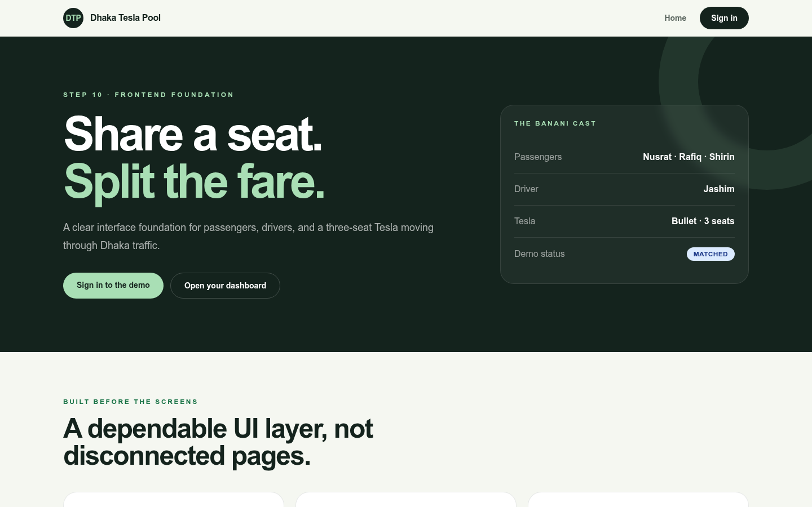
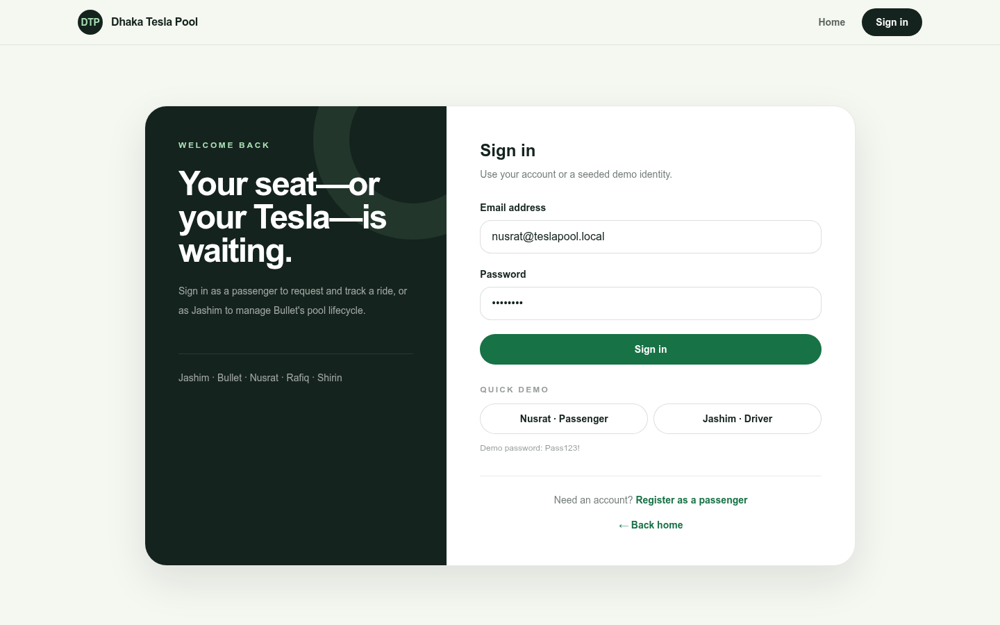
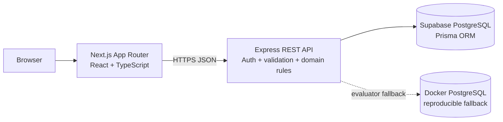
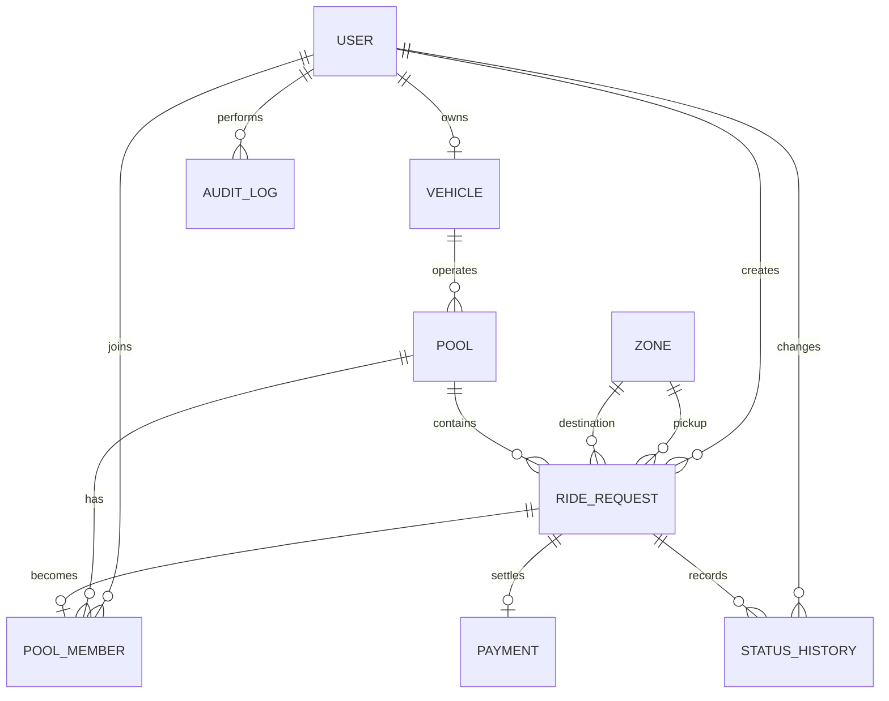

# Dhaka Tesla Pool

> Share a seat. Split the fare. Survive Dhaka traffic.

Dhaka Tesla Pool is a production-minded ride-pooling MVP built around the Banani rush-hour story. Nusrat, Rafiq, and Shirin request seats; Jashim drives **Bullet**, a fixed-capacity three-seat Tesla; compatible requests share one pool while each passenger keeps an individual fare, status, and history.

## Live demo

| Resource | URL |
|---|---|
| Frontend | https://dhaka-tesla-pool-v2-web.vercel.app |
| API health | https://dhaka-tesla-pool-api-1h5u.onrender.com/health |
| Six-minute walkthrough | Pending Step 15 recording |

Deployment instructions and the exact post-deploy verification sequence are in [docs/deployment.md](docs/deployment.md).

## Problem

Nusrat travels from Banani to Mohakhali while Rafiq travels from Banani to Gulshan 1. Their routes overlap, so the system should place them in the same Tesla when capacity and route compatibility allow it. The difficult parts are not map rendering: they are ownership, lifecycle rules, individual fare snapshots, capacity integrity, and ensuring two simultaneous requests cannot take Bullet's final seat.

## Implemented features

### Passenger

- Passenger registration and login
- Predefined Dhaka pickup and destination zones
- One-to-three-seat ride requests
- Live, hand-checkable pooled-fare estimate
- Personal ride status and fare visibility
- Status timeline and ride history
- Valid cancellation while `REQUESTED` or `MATCHED`
- Ownership enforcement: passengers cannot read or modify another passenger's ride

### Driver / Tesla

- Seeded Jashim driver account and Bullet vehicle
- Online/offline availability with active-pool safety rules
- Relevant request list filtered by route and remaining capacity
- Accept request into a new or compatible open pool
- Passenger, route, seat, fare, and occupancy visibility
- Explicit arrive, start, and complete actions
- Active and completed pool history

### Pooling and integrity

- Same-pickup and compatible-destination matching
- Explicit pool membership
- Fixed three-seat capacity
- Transactional seat allocation with PostgreSQL row locking
- Individual immutable fare snapshots
- Atomic pool and passenger lifecycle updates
- Status history and audit logs
- Real concurrent final-seat integration test

### Interface and operations

- Responsive Next.js interface
- Role-aware protected routes and navigation
- Loading, error, empty, confirmation, disabled, and success states
- Typed frontend API client
- Structured backend logging, Helmet, CORS, validation, and normalized errors
- Supabase PostgreSQL workflow
- Reproducible Docker Compose environment with health checks, migration, and seed

## Screenshots

### Home



### Sign in



More passenger, driver, pooling, and edge-case screenshots are captured during the Step 15 release walkthrough.

## Demo identities

The seed is idempotent and uses the PRD cast consistently.

| Role | Name | Email | Password |
|---|---|---|---|
| Driver | Jashim | `jashim@teslapool.local` | `Pass123!` |
| Passenger | Nusrat | `nusrat@teslapool.local` | `Pass123!` |
| Passenger | Rafiq | `rafiq@teslapool.local` | `Pass123!` |
| Passenger | Shirin | `shirin@teslapool.local` | `Pass123!` |

These are demo-only credentials. No production secret is committed.

## Lifecycle

```text
REQUESTED → MATCHED → DRIVER_ARRIVED → STARTED → COMPLETED
     └──────────────→ CANCELLED ←──────────────┘
```

- A passenger may cancel only from `REQUESTED` or `MATCHED`.
- A driver moves a pool through `OPEN → ARRIVED → IN_PROGRESS → COMPLETED`.
- Pool commands atomically update every active member's ride status and history.
- Skipped, repeated, reversed, and terminal transitions are rejected.

## Matching and fare rules

### Matching

Requests can share a pool when:

1. pickup zone IDs are identical;
2. destinations are at most **4 km apart** by Haversine distance;
3. the pool is still `OPEN`; and
4. requested seats fit Bullet's remaining capacity.

### Fare

```text
passengerFare = baseFare + distanceCharge - poolDiscount
baseFare      = ৳30.00
distanceRate  = ৳15.00/km
poolDiscount  = 15%
```

Money is stored as integer paisa to avoid floating-point rounding errors.

| Passenger route | Distance | Calculation | Fare |
|---|---:|---|---:|
| Nusrat: Banani → Mohakhali | 4 km | `(৳30 + 4 × ৳15) − 15%` | **৳76.50** |
| Rafiq: Banani → Gulshan 1 | 3 km | `(৳30 + 3 × ৳15) − 15%` | **৳63.75** |

Configured demo routes use fixed road estimates. Other zone pairs use Haversine distance multiplied by a documented `1.35` road factor. Payment is cash or simulated TeslaPay; there is no real gateway.

## Architecture



The browser never talks directly to PostgreSQL. The Express API owns authentication, authorization, validation, fares, lifecycle transitions, and seat allocation.

Detailed diagrams and request flows: [Architecture](docs/architecture.md).

## ERD



Every relationship, table, index, and integrity rule is explained in [docs/erd.md](docs/erd.md).

## Technology stack

| Layer | Choice | Why it fits |
|---|---|---|
| Frontend | Next.js App Router, React, TypeScript, Tailwind CSS | Clear routes, typed UI, responsive product states |
| Backend | Node.js, Express, TypeScript, Zod | Small, explicit REST and middleware boundaries |
| Database | PostgreSQL on Supabase | Transactions, constraints, row locks, relational history |
| ORM | Prisma | Typed schema, migrations, relations, raw SQL where locking is required |
| Authentication | JWT + bcrypt | Visible role/ownership enforcement for the challenge |
| Tests | Vitest + Supertest | Fast domain tests plus real HTTP/PostgreSQL integration |
| Local delivery | Docker Compose | Reproducible app and database environment |
| Hosting plan | Vercel + Render + Supabase | Free-tier-oriented and replaceable |

Alternatives, trade-offs, and switch conditions are documented in [docs/technology-decisions.md](docs/technology-decisions.md).

## Project structure

```text
.
├── apps/
│   ├── api/
│   │   ├── prisma/            # schema, migrations, seed
│   │   ├── src/modules/       # auth, geography, passenger, pool, driver
│   │   └── tests/             # unit and integration tests
│   └── web/
│       ├── app/               # App Router pages
│       ├── components/        # shared and product UI
│       ├── lib/               # typed API/auth/domain helpers
│       └── providers/         # browser session provider
├── docker/                    # API entrypoint
├── docs/                      # design, operations, scale, and submission docs
├── docker-compose.yml
├── render.yaml
└── package.json
```

## Prerequisites

- Node.js 22+
- npm 10+
- PostgreSQL database, normally Supabase
- Optional: Docker Desktop with Compose

## Environment variables

Copy the template:

```bash
cp .env.example .env
```

PowerShell:

```powershell
Copy-Item .env.example .env
```

| Variable | Used by | Purpose |
|---|---|---|
| `NODE_ENV` | API | `development`, `test`, or `production` |
| `PORT` | API host | Hosting-provider port; overrides `API_PORT` |
| `API_PORT` | API | Local API port, default `4000` |
| `WEB_ORIGIN` | API | Allowed frontend origin; comma-separated values supported |
| `DATABASE_URL` | Prisma/API | Runtime PostgreSQL URL |
| `DIRECT_URL` | Prisma | Direct PostgreSQL URL for migrations |
| `JWT_SECRET` | API | At least 24 characters; never expose to the frontend |
| `LOG_LEVEL` | API | Pino logging level |
| `NEXT_PUBLIC_API_URL` | Web build | Browser-facing API URL ending in `/api` |

Never commit `.env`, `.env.test`, tokens, connection strings, or real passwords.

## Local setup with Supabase

```bash
npm install
npm run db:generate
npx prisma migrate deploy --schema apps/api/prisma/schema.prisma
npm run db:seed
npm run dev
```

Open:

- Frontend: `http://localhost:3000`
- API health: `http://localhost:4000/health`

## Docker setup

```bash
docker compose up --build
```

The Compose stack starts PostgreSQL 16, applies migrations, upserts the story seed, starts the API, waits for health, and starts the standalone frontend.

```bash
docker compose ps
docker compose logs -f
docker compose down
```

Full instructions and reset behavior: [docs/docker.md](docs/docker.md).

## Tests

### Unit/domain

```bash
npm run test:typecheck
npm run test:unit
```

Current result: **44 tests passing**.

### Real API/PostgreSQL integration

```powershell
Copy-Item .env.test.example .env.test
npm run db:test:prepare
npm run test:integration
```

Current result: **6 integration scenarios passing**, including the real concurrent final-seat race.

The concurrency test starts Rafiq and Shirin's final-seat requests together. Exactly one succeeds, one receives `409 POOL_CAPACITY_EXCEEDED`, occupancy remains `3`, and the loser has no partial membership. See [docs/testing.md](docs/testing.md).

## REST API overview

| Area | Endpoints |
|---|---|
| Auth | `POST /api/auth/register`, `POST /api/auth/login`, `GET /api/auth/me` |
| Geography | `GET /api/zones`, `POST /api/zones/estimate` |
| Passenger | create/list/read/cancel `/api/passenger/rides` |
| Driver | vehicle, online status, relevant requests, accept ride, pools |
| Lifecycle | arrive/start/complete explicit pool commands |
| Health | `GET /health`, `GET /api/health` |

Request/response rules and stable error codes: [docs/api-contract.md](docs/api-contract.md).

## Key decisions and trade-offs

- **Modular monolith over microservices:** easier to deploy, debug, and explain for one bounded MVP.
- **REST over GraphQL:** explicit resource and command endpoints match the small workflow.
- **PostgreSQL as capacity authority:** `SELECT ... FOR UPDATE` serializes competing allocations; the UI's available-seat value is advisory.
- **Integer paisa:** deterministic arithmetic without floating-point money errors.
- **Predefined zones:** enough to evaluate matching without rebuilding Google Maps.
- **JWT in local storage:** simple for an MVP demo, but a production identity system should use secure `HttpOnly` cookies, CSRF protection, and refresh rotation.
- **Polling over WebSockets:** keeps the MVP operationally small; real-time transport is a future improvement.

## Known limitations

- No live GPS, turn-by-turn routing, traffic, or map provider
- One seeded driver and one fixed-capacity vehicle
- No real payment gateway
- No password reset, MFA, social login, rating, or support workflow
- Dashboard updates use polling rather than push events
- Free backend hosting may cold-start
- Browser end-to-end automation is not included; risk-focused API integration is included

## Next improvements

- Secure cookie-based sessions and refresh rotation
- PostGIS-based pickup and route matching
- WebSocket/SSE ride status updates
- Idempotency keys for ride and driver commands
- Rate limiting and abuse controls
- Payment/rating workflows
- Browser E2E smoke tests
- Production observability, backup drills, and deployment rollback automation

The reasoned 1M-passenger/100k-driver evolution is documented in [docs/scaling.md](docs/scaling.md).

## AI usage

AI use is disclosed rather than hidden.

- **Tools:** ChatGPT/Notion AI for implementation planning, code review, test-scenario generation, documentation structure, and debugging support; official Next.js, Express, Prisma, PostgreSQL, Supabase, Vitest, Supertest, Docker, Render, and Vercel documentation for verification.
- **Accepted suggestion:** use a PostgreSQL row lock plus one transaction for final-seat allocation, then prove it with two concurrent HTTP requests and database assertions.
- **Rejected/changed suggestion:** do not add Redis, queues, microservices, or direct frontend-to-database writes merely to look scalable. The implemented MVP keeps one Express boundary and PostgreSQL as the consistency authority; future scaling is reasoned separately.
- **Ownership:** every generated suggestion was reviewed, tested, and adapted to this domain. The author remains responsible for explaining and modifying the architecture, schema, authentication, pooling, failure paths, and concurrency behavior.

## Supporting documents

- [Architecture](docs/architecture.md)
- [Domain and fare rules](docs/domain-model.md)
- [ERD](docs/erd.md)
- [Technology decisions](docs/technology-decisions.md)
- [API contract](docs/api-contract.md)
- [Frontend flows](docs/frontend-flows.md)
- [Testing and concurrency](docs/testing.md)
- [Docker](docs/docker.md)
- [Deployment](docs/deployment.md)
- [Viral-scale reasoning](docs/scaling.md)
- [Six-minute video script](docs/video-script.md)
- [Submission checklist](docs/submission-checklist.md)

## License

This repository was created for the RoBenDevs Software Engineer Internship challenge.