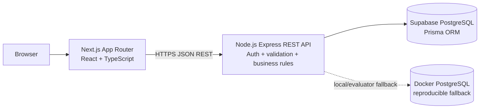
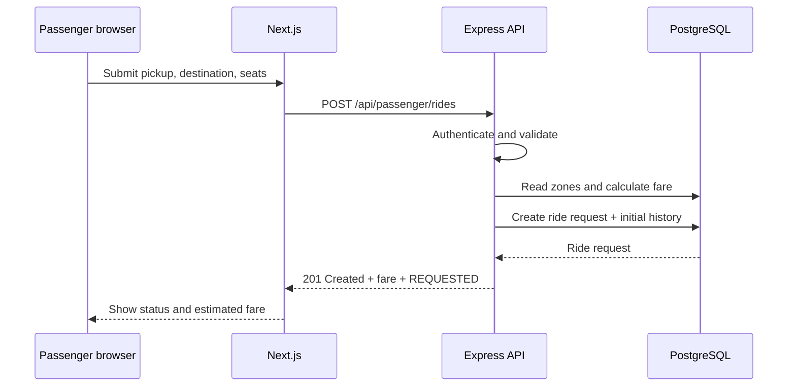
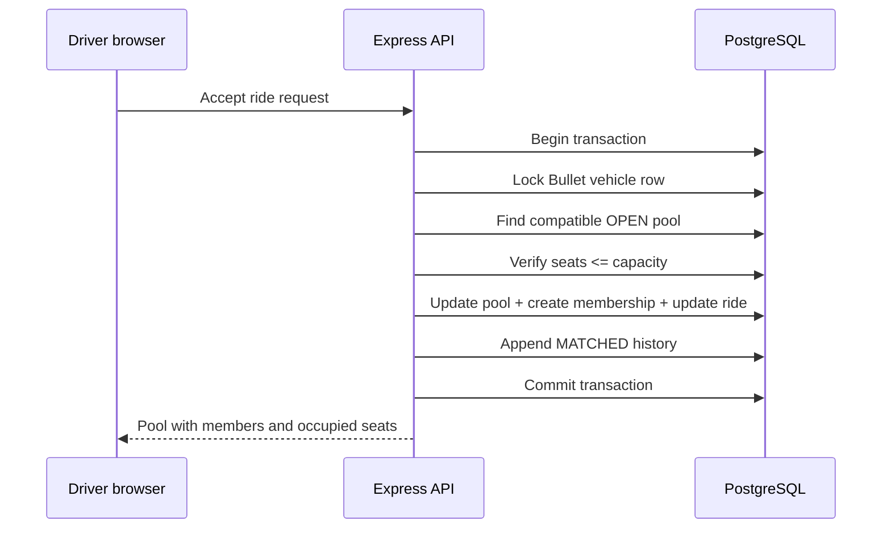

# Dhaka Tesla Pool — Architecture

## 1. Product boundary

Dhaka Tesla Pool is a ride-pooling MVP, not a full navigation or payment platform. The system accepts passenger ride requests, matches compatible requests into a driver-owned Tesla pool, calculates an individual fare for each passenger, and records the ride lifecycle.

The MVP intentionally does not solve road-network routing. Geography is represented by predefined Dhaka zones with fixed latitude/longitude points and a documented compatibility rule.

## 2. Actors

| Actor | Responsibilities |
|---|---|
| Passenger | Register/sign in, request a ride, see an estimated individual fare, track own status, cancel while valid, view own history |
| Driver | Sign in, go online/offline, own a fixed-capacity Tesla, review relevant requests, accept a request/pool, mark arrival, start and complete a trip, view passengers/seats/history |
| Pool/Ride split | Group compatible ride requests, enforce Bullet's capacity, store obvious membership, calculate individual fares, preserve status history |

## 3. Runtime architecture



The browser never connects directly to PostgreSQL. It talks to the API, which owns authentication, authorization, validation, fare calculation, state transitions, and pool capacity enforcement.

## 4. Responsibility boundaries

### Next.js frontend

- Render passenger and driver workflows
- Collect and validate user input for usability
- Show loading, error, empty, and success states
- Call the REST API
- Never make the final capacity or authorization decision

### Express API

- Authenticate the caller
- Authorize the role and resource ownership
- Validate request payloads
- Apply ride and pool business rules
- Execute capacity-sensitive writes in a database transaction
- Return consistent HTTP errors
- Log important failures without logging secrets

### PostgreSQL

- Store relational domain data
- Enforce foreign keys, unique constraints, indexes, and enum values
- Provide transactional consistency and row locking for the last-seat race
- Preserve status history and audit information

## 5. Why a modular monolith

The MVP has one bounded product domain and a small team. A modular monolith keeps deployment and debugging simple while allowing clear modules for auth, geography/fare, passenger rides, pooling, and driver operations. Microservices, Kafka, Kubernetes, Redis, and queues are intentionally not introduced until traffic, team boundaries, or reliability requirements justify them.

## 6. Main request flow



## 7. Pool acceptance flow



The frontend availability value is advisory only. The database transaction is the final authority.

## 8. Error contract

API errors use a predictable shape:

```json
{
  "message": "Not enough seats available in Bullet",
  "code": "POOL_CAPACITY_EXCEEDED",
  "details": {}
}
```

Typical status codes:

| Status | Meaning |
|---:|---|
| 400 | Invalid input or invalid state transition |
| 401 | Missing or invalid authentication |
| 403 | Valid user but insufficient role/ownership permission |
| 404 | Resource does not exist or is not visible to the caller |
| 409 | State conflict, incompatible pool, or capacity race |
| 500 | Unexpected server failure |

## 9. Security boundary

- Passwords are stored as bcrypt hashes, never plain text.
- JWTs identify the authenticated API user.
- Every protected resource query includes role and ownership checks.
- Database URLs, JWT secrets, and Supabase credentials remain server-side.
- `.env` is ignored and `.env.example` contains placeholders only.
- The frontend cannot bypass the API to change ride status or pool capacity.
