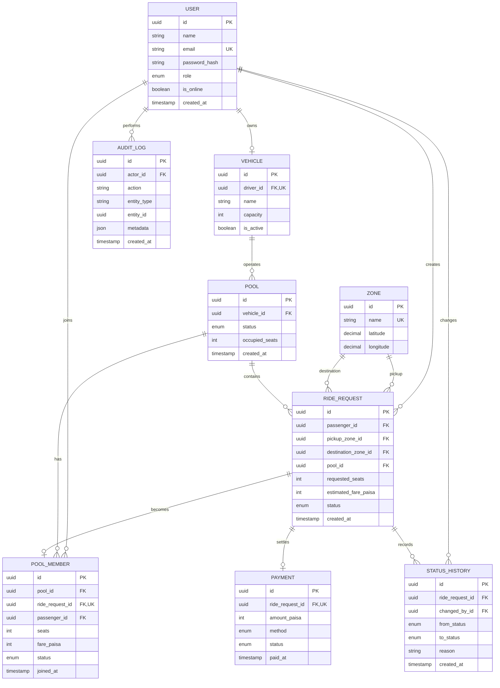

# Dhaka Tesla Pool — ERD

The database is designed as a relational model because rides, pools, passengers, vehicles, and status history have strong relationships and consistency rules.

## Relationship explanations

- One driver owns one active vehicle in the MVP; the schema can later support multiple vehicles.
- One passenger can create many ride requests.
- One vehicle operates many pools over time.
- One pool contains many ride requests and pool memberships.
- One ride request has at most one active pool membership.
- One ride request has many status history records.
- One completed ride may have one simulated payment record.
- Audit logs are append-only operational history and are not used as the current state.

## Integrity rules planned for Step 3

- `users.email` is unique.
- `vehicles.driver_id` is unique for the MVP.
- `zones.name` is unique.
- `pool_members.ride_request_id` is unique.
- `payments.ride_request_id` is unique.
- Foreign keys use restrictive or cascading behavior intentionally per relationship.
- Indexes cover passenger/status, pool/status, vehicle/status, and history timestamps.
