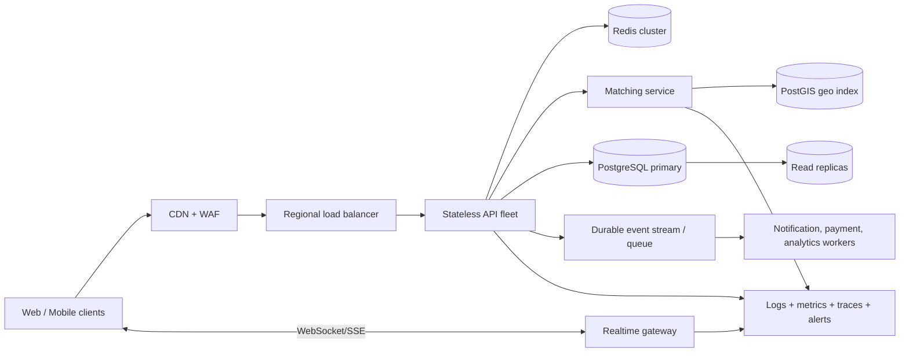

# If Oi Tesla Goes Viral

This is a future evolution for roughly **1M passengers and 100k drivers**, not technology added to the MVP prematurely.

## Target architecture

## Load balancing and horizontal scaling

- Keep API instances stateless so they can scale horizontally behind regional load balancers.
- Store identity/session authority outside process memory.
- Autoscale on latency, request rate, queue depth, and database saturation rather than CPU alone.
- Use multi-availability-zone deployments and gradual canary releases.

## Database, indexing, and contention

- Preserve PostgreSQL as the source of truth for ride, membership, fare, and lifecycle writes.
- Add composite indexes for active requests by pickup geohash/status/time, driver availability, pool status, and passenger history.
- Move non-critical history and analytics reads to replicas.
- Partition high-volume ride, status-history, and audit tables by time and/or city region.
- Use short transactions, deterministic lock order, bounded retries, and optimistic version columns where appropriate.
- Keep the final capacity update conditional (`occupied + requested <= capacity`) and idempotent.
- Measure hot-vehicle and hot-zone contention before splitting ownership across services.

## Geospatial matching

- Replace the predefined-zone scan with PostGIS or a specialized geospatial index.
- Search nearby available drivers and compatible pickup corridors by bounded radius/geohash.
- Rank candidates by pickup ETA, route overlap, available seats, fairness, and cancellation risk.
- Keep matching approximate and fast, but make seat reservation transactional and authoritative.

## Caching

- Cache public zone/configuration data, fare parameters, and short-lived driver-location tiles.
- Never treat cache as the final capacity or lifecycle authority.
- Use short TTLs and event-based invalidation for availability.
- Protect the database from cache stampedes with request coalescing and jittered expiry.

## Queues and events

- Publish committed domain events through a transactional outbox so database state and emitted events cannot diverge.
- Use queues for notifications, receipts, analytics, payment simulation, and retryable external calls.
- Do not put the synchronous final-seat decision behind an eventually consistent queue.
- Make every consumer idempotent and send exhausted failures to a dead-letter queue.

## Real-time communication

- Use WebSockets or SSE for driver location and lifecycle updates.
- Authenticate connections, authorize channel membership, and expire subscriptions.
- Persist important state in PostgreSQL; realtime messages are hints that trigger a refetch.
- Fall back to polling when a connection is unavailable.

## Rate limiting and idempotency

- Apply IP/account/device limits at the edge and stricter limits to login, ride creation, and matching commands.
- Accept idempotency keys for ride requests, accept, arrival, start, complete, and payment operations.
- Store the key, actor, normalized request hash, and response for a bounded period.
- Reject reuse of the same key with different payloads.

## Retry and failure strategy

- Retry only transient errors with exponential backoff and jitter.
- Bound database deadlock/serialization retries.
- Use circuit breakers and timeouts for external map, notification, and payment providers.
- Design compensating actions for reservations that expire before pickup.
- Degrade gracefully: stale map display is acceptable; corrupted capacity is not.

## Observability

- Propagate request/correlation IDs through API, matching, queue, and worker operations.
- Measure p50/p95/p99 latency, match time, capacity conflicts, cancellation rate, queue lag, DB locks, error rates, and realtime disconnects.
- Trace the complete ride request and allocation path.
- Alert on user-impacting SLOs, not every isolated error.
- Keep structured audit events for privileged and lifecycle changes.

## Security

- Move sessions to secure cookies or short-lived access tokens with refresh rotation.
- Add MFA and risk controls for drivers and operations users.
- Use a managed secret store, least-privilege database roles, encryption in transit/at rest, dependency scanning, and regular key rotation.
- Minimize retained location data and define deletion/retention policies.
- Add fraud detection, abuse reporting, and administrative actions with immutable audit history.

## Deployment strategy

- Use infrastructure as code, isolated environments, migration gates, automated smoke tests, and rollback rehearsals.
- Roll out by canary percentage or region.
- Back up PostgreSQL continuously and test point-in-time restore.
- Maintain regional recovery objectives and a documented incident process.

The first scaling change should follow measured pressure. The MVP intentionally avoids Redis, queues, microservices, and Kubernetes until their operational cost solves an observed problem.